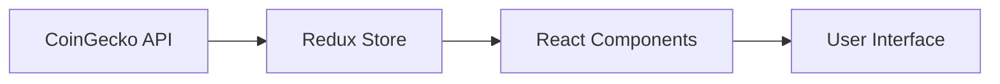
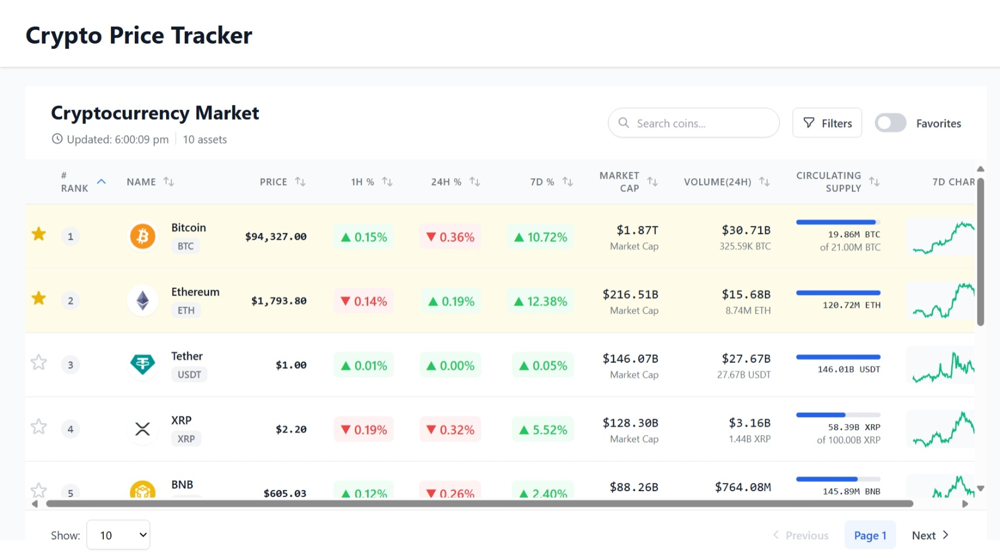
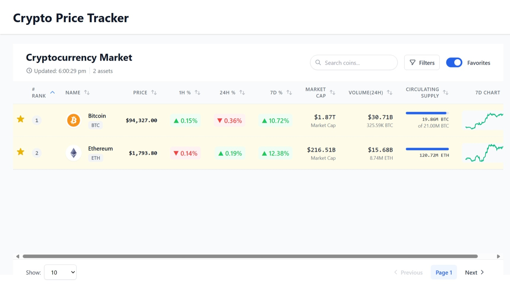
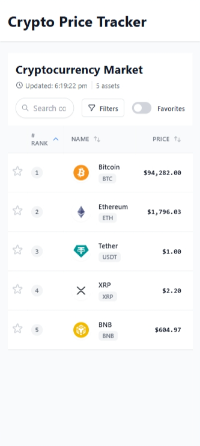
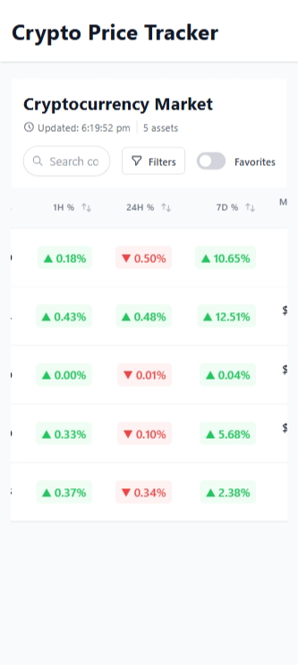
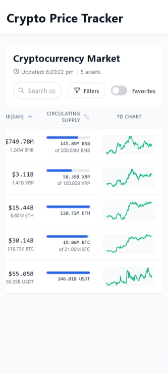

# Real-time Crypto Price Tracker

A React-based cryptocurrency tracking application that provides real-time price updates and market data visualization.


## 🚀 Tech Stack

- **Frontend**: React 19 + Vite
- **State Management**: Redux Toolkit
- **Styling**: TailwindCSS
- **API**: CoinGecko
- **Charts**: Sparkline charts
- **Build Tool**: Vite

## 🏗️ Architecture



## ⚙️ Setup Instructions

1. Clone the repository:
```bash
git clone https://github.com/your-username/Real-time-Crypto-Price-Tracker.git
cd Real-time-Crypto-Price-Tracker
```

2. Install dependencies:
```bash
npm install
```

3. Create `.env` file:
```bash
VITE_API_URL=https://api.coingecko.com/api/v3
```

4. Start development server:
```bash
npm run dev
```

5. Build for production:
```bash
npm run build
```

## 🌟 Features

- Real-time price updates (10s interval)
- Interactive data table with sorting
- Price change tracking (1h, 24h, 7d)
- Favorites system with localStorage
- Sparkline price history charts
- Responsive design
- Advanced filtering options

## 📸 Screenshots

### Dashboard View



### Mobile Responsive Design





## 🎥 Video Demo

Watch the full demo video:

[](https://drive.google.com/file/d/1dnkJbe3XGTCOmfl0hkoHr54GtPew2bz3/view?usp=sharing)

## 🤝 Contributing

1. Fork the repository
2. Create your feature branch (`git checkout -b feature/AmazingFeature`)
3. Commit changes (`git commit -m 'Add AmazingFeature'`)
4. Push to branch (`git push origin feature/AmazingFeature`)
5. Open a Pull Request.